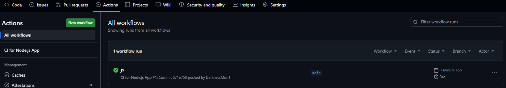
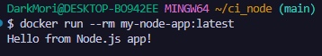

# CI Pipeline для Node.js приложения в GitHub Actions

Этот проект представляет собой учебный пример настройки **Continuous Integration (CI)** для простого Node.js приложения с использованием **GitHub Actions** и **Docker**.

## 🎯 Цель работы

Создать автоматический CI-пайплайн, который при каждом `push` или `pull request` в ветку `main` будет выполнять:

- **Линтинг** кода с помощью `ESLint`
- **Запуск тестов** с помощью `Jest`
- **Сборку Docker-образа** (без публикации в registry)

## 🧱 Структура проекта

```markdown
my-node-app/
├── .github/
│   └── workflows/
│       └── ci.yml          # GitHub Actions workflow
├── src/
│   └── index.js            # основной код приложения
├── tests/
│   └── index.test.js       # модульные тесты (Jest)
├── package.json            # зависимости и скрипты
├── package-lock.json       # фиксация версий зависимостей
├── .eslintrc.json          # конфигурация ESLint
├── Dockerfile              # инструкция для сборки образа
└── README.md               # описание проекта
```

## 📄 Содержание файлов проекта

### `package.json`

```json
{
  "name": "my-node-app",
  "version": "1.0.0",
  "description": "Пример CI для Node.js",
  "main": "src/index.js",
  "scripts": {
    "test": "jest",
    "lint": "eslint src",
    "start": "node src/index.js"
  },
  "devDependencies": {
    "eslint": "^8.56.0",
    "jest": "^29.7.0"
  }
}
```

### `src/index.js`

```javascript
function add(a, b) {
    return a + b;
}

function main() {
    console.log("Hello from Node.js app!");
}

if (require.main === module) {
    main();
}

module.exports = { add };
```

### `tests/index.test.js`

```javascript
const { add } = require('../src/index');

test('adds 2 + 3 to equal 5', () => {
    expect(add(2, 3)).toBe(5);
});

test('adds -1 + 1 to equal 0', () => {
    expect(add(-1, 1)).toBe(0);
});

test('adds 0 + 0 to equal 0', () => {
    expect(add(0, 0)).toBe(0);
});
```

### `.eslintrc.json`

```json
{
  "env": {
    "node": true,
    "jest": true
  },
  "extends": "eslint:recommended",
  "parserOptions": {
    "ecmaVersion": 2021
  },
  "rules": {
    "no-unused-vars": "warn"
  }
}
```

**Что делает этот конфиг?**
- `env` – указывает ESLint, что код выполняется в среде Node.js и используются глобальные переменные Jest (`describe`, `test`, `expect` и т.д.)
- `extends: "eslint:recommended"` – включает набор рекомендуемых правил
- `parserOptions` – указывает современную версию JavaScript (ECMAScript 2021)
- `rules` – настраивает правило: предупреждать о неиспользуемых переменных, но не прерывать выполнение

### `Dockerfile`

```dockerfile
FROM node:18-alpine
WORKDIR /app
COPY package*.json ./
RUN npm ci --only=production
COPY . .
CMD ["node", "src/index.js"]
```

### `.github/workflows/ci.yml`

```yaml
name: CI for Node.js App

on:
  push:
    branches: [ main, master ]
  pull_request:
    branches: [ main, master ]

jobs:
  test:
    name: Lint & Test
    runs-on: ubuntu-latest
    strategy:
      matrix:
        node-version: [18.x, 20.x, 22.x]
    steps:
      - uses: actions/checkout@v4
      - name: Use Node.js ${{ matrix.node-version }}
        uses: actions/setup-node@v4
        with:
          node-version: ${{ matrix.node-version }}
          cache: 'npm'
      - run: npm ci
      - run: npm run lint
      - run: npm test

  docker-build:
    name: Build Docker Image (no push)
    runs-on: ubuntu-latest
    needs: test
    if: github.event_name == 'push' && github.ref == 'refs/heads/main'
    steps:
      - uses: actions/checkout@v4
      - run: docker build -t my-node-app:test .
```

## 🚀 Установка и запуск

### 1. Создание структуры проекта (bash-команда)

```bash
mkdir -p .github/workflows src tests && \
touch .github/workflows/ci.yml src/index.js tests/index.test.js package.json .eslintrc.json Dockerfile README.md
```

### 2. Генерация `package-lock.json` через Docker (без установки Node.js)

> **💡 Вам не нужно устанавливать Node.js на свою ОС. Используйте Docker, который у вас уже есть!**

```bash
docker run --rm -v "//$(pwd)/app" -w //app node:18-alpine npm install --package-lock-only
```

### 3. Запуск CI в GitHub Actions

1. Создайте публичный репозиторий `my-node-app` с `README.md`
2. Склонируйте его и добавьте все файлы по указанной структуре
3. Закоммитьте и запушьте в ветку `main`

После пуша перейдите на вкладку **Actions** вашего репозитория:



*Ожидайте зелёную галочку — все шаги прошли успешно.*

## 🐳 Локальная проверка Docker-образа

На своём компьютере в папке проекта выполните:

### Сборка образа

```bash
docker build -t my-node-app:latest .
```

### Запуск контейнера

```bash
docker run --rm my-node-app:latest
```

**Ожидаемый вывод:**

```
Hello from Node.js app!
```



### Интерактивный режим (опционально)

Для ознакомления и отладки внутри контейнера:

```bash
docker run --rm -it my-node-app:latest /bin/sh
```

Выход из контейнера:

```bash
exit
```

## 📋 Проверка локально (без Docker)

Если Node.js установлен на вашей системе:

```bash
# Установка зависимостей
npm install

# Запуск линтинга
npm run lint

# Запуск тестов
npm test

# Запуск приложения
npm start
```

## ✅ Результаты

- [x] Настроен CI-пайплайн в GitHub Actions
- [x] Автоматический линтинг (`ESLint`) при каждом push/PR
- [x] Автоматический запуск тестов (`Jest`) на Node.js 18.x, 20.x, 22.x
- [x] Сборка Docker-образа только при пуше в `main` после успешных тестов
- [x] Локальная сборка и запуск Docker-образа работают корректно
- [x] `package-lock.json` сгенерирован через Docker без локальной установки Node.js

## 🔧 Возможные проблемы и решения

### Ошибка при создании файлов в PowerShell

Если вы используете PowerShell, выполните команды по отдельности:

```powershell
# Создание директорий
New-Item -ItemType Directory -Force -Path .github/workflows, src, tests

# Создание файлов
New-Item -ItemType File -Force -Path .github/workflows/ci.yml
New-Item -ItemType File -Force -Path src/index.js
New-Item -ItemType File -Force -Path tests/index.test.js
New-Item -ItemType File -Force -Path package.json
New-Item -ItemType File -Force -Path .eslintrc.json
New-Item -ItemType File -Force -Path Dockerfile
New-Item -ItemType File -Force -Path README.md
```

### Ошибка при генерации package-lock.json на Windows

В PowerShell используйте `${PWD}` вместо `$(pwd)`:

```powershell
docker run --rm -v "${PWD}:/app" -w /app node:18-alpine npm install --package-lock-only
```

## 📝 Примечание

> Если вы обнаружили ошибку в этом тексте — сообщите пожалуйста автору!

---

> 🧪 Проект создан в учебных целях для демонстрации основ Continuous Integration с Node.js, ESLint, Jest и Docker.
```

## 📸 Как добавить реальные скриншоты:

1. Создайте в корне репозитория папку `screenshots`
2. Сохраните туда два скриншота:
   - `4_workflow.png` — вкладка Actions с зелёной галочкой
   - `3_workflow.png` — терминал с выводом `Hello from Node.js app!`
3. Если вы хотите использовать другие пути к изображениям — просто поправьте ссылки в `README.md`

## 💡 Отличия от Python-версии:

| Аспект | Python | Node.js |
|--------|--------|---------|
| Линтер | flake8 | ESLint |
| Тесты | pytest | Jest |
| Менеджер пакетов | pip | npm |
| Файл зависимостей | requirements.txt | package.json + package-lock.json |
| Установка | pip install -e . | npm ci |
| Версии в матрице | 3.9, 3.10, 3.11, 3.12 | 18.x, 20.x, 22.x |

Этот `README.md` полностью готов к публикации и содержит все инструкции, код и места для скриншотов для Node.js версии задания!